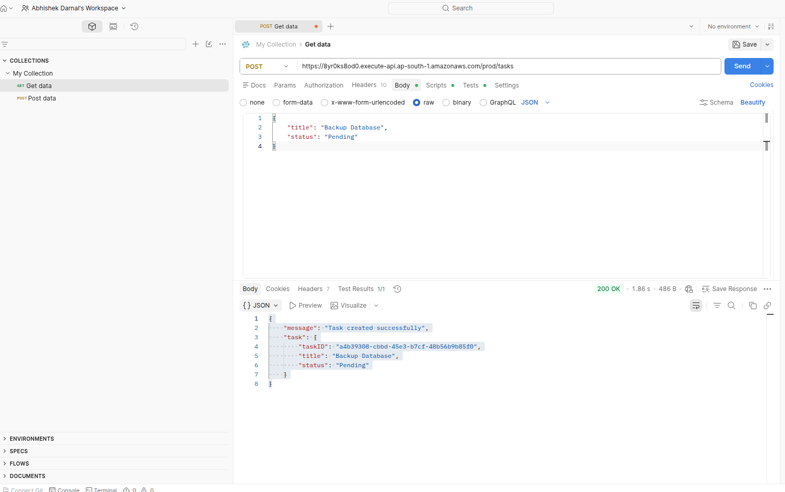
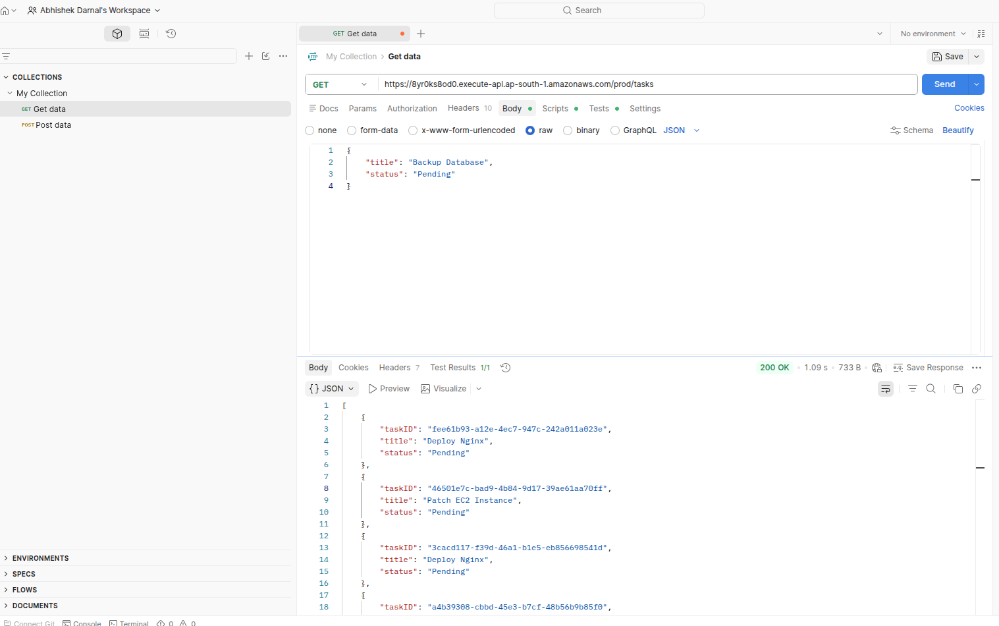

# AWS Serverless Task Management API

A fully serverless REST API built using **AWS Lambda**, **Amazon API Gateway**, and **Amazon DynamoDB**. The application performs complete CRUD (Create, Read, Update, Delete) operations on tasks without managing any servers.

---

## Project Overview

This project demonstrates how to build a scalable serverless backend on AWS using managed services.

### Features

- Create Tasks
- Retrieve All Tasks
- Update Task Status
- Delete Tasks
- Serverless Architecture
- IAM Role-Based Permissions
- Highly Scalable

---

#  Architecture

<p align="center">
  <
.png" width="900">
</p>

---

# ☁️ AWS Services Used

| Service | Purpose |
|----------|---------|
| AWS Lambda | Business Logic |
| Amazon API Gateway | REST API |
| Amazon DynamoDB | NoSQL Database |
| AWS IAM | Permissions |
| Amazon CloudWatch | Logs & Monitoring |

---

# 📂 Project Structure

```
aws-serverless-task-api/
│
├── lambda/
│   ├── create-task.py
│   ├── get-tasks.py
│   ├── update-task.py
│   └── delete-task.py
│
├── screenshots/
│   ├── api-gateway.png
│   ├── lambda-functions.png
│   ├── dynamodb-table.png
│   ├── postman-post.png
│   ├── postman-get.png
│   ├── postman-put.png
│   └── postman-delete.png
│
├── architecture.png
└── README.md
```

---

# 🔗 API Endpoints

| Method | Endpoint | Description |
|---------|----------|-------------|
| POST | `/tasks` | Create a Task |
| GET | `/tasks` | Retrieve All Tasks |
| PUT | `/tasks` | Update Task Status |
| DELETE | `/tasks` | Delete Task |

---

# 📨 Sample Requests

## Create Task

### POST `/tasks`

```json
{
  "title": "Deploy Nginx",
  "status": "Pending"
}
```

Response

```json
{
  "message": "Task created successfully",
  "task": {
    "taskID": "41c4dfc4-8787-4454-97af-8bbff4636d16",
    "title": "Deploy Nginx",
    "status": "Pending"
  }
}
```

---

## Update Task

### PUT `/tasks`

```json
{
  "taskID": "41c4dfc4-8787-4454-97af-8bbff4636d16",
  "status": "Completed"
}
```

---

## Delete Task

### DELETE `/tasks`

```json
{
  "taskID": "41c4dfc4-8787-4454-97af-8bbff4636d16"
}
```

---

## Get Tasks

### GET `/tasks`

Returns

```json
[
  {
    "taskID": "...",
    "title": "Deploy Nginx",
    "status": "Completed"
  }
]
```

---

# 📸 Screenshots

## API Gateway


---

## Lambda Functions


---

## DynamoDB Table


---

## Create Task (POST)



---

## Retrieve Tasks (GET)



---

## Update Task (PUT)


---

## Delete Task (DELETE)


---

# 🚀 Deployment Steps

1. Create a DynamoDB table (`CloudTasks`)
2. Create Lambda functions for CRUD operations
3. Configure IAM permissions for DynamoDB access
4. Create REST API in API Gateway
5. Integrate each endpoint with the corresponding Lambda function
6. Deploy the API
7. Test using Postman

---

# 📚 Skills Demonstrated

- AWS Lambda
- Amazon API Gateway
- Amazon DynamoDB
- IAM Roles & Policies
- REST API Development
- Python (Boto3)
- JSON Handling
- CRUD Operations
- Serverless Computing
- API Testing with Postman

---

# 🎯 Learning Outcomes

Through this project, I gained practical experience in:

- Designing serverless architectures
- Building REST APIs on AWS
- Managing NoSQL databases with DynamoDB
- Configuring IAM permissions securely
- Debugging Lambda functions using CloudWatch Logs
- Testing APIs using Postman

---

## 👤 Author

**Abhishek Darnal**

GitHub: https://github.com/Darnal15

---

⭐ If you found this project useful, consider giving it a star!****
